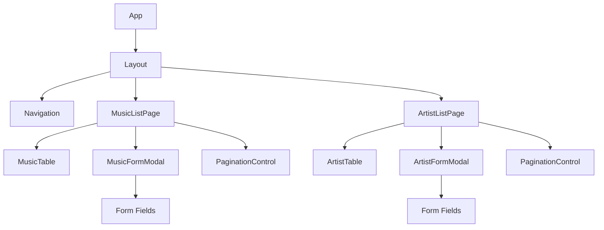

# デザインドキュメント

## Overview

このドキュメントは、プロジェクトセカイ（プロセカ）の楽曲マスタデータとアーティストマスタデータを管理するWebページの設計を定義します。

### システムの目的

既存のREST APIを利用して、楽曲情報とアーティスト情報の閲覧、登録、更新、削除を行うWebインターフェースを提供します。

### 技術スタック

- **フロントエンドフレームワーク**: Vue 3 with TypeScript
- **状態管理**: Composition API (ref, reactive, computed)
- **HTTPクライアント**: Fetch API
- **UIライブラリ**: Tailwind CSS
- **ルーティング**: Vue Router v4
- **フォーム管理**: VeeValidate
- **バリデーション**: Zod
- **ビルドツール**: Vite
- **パッケージマネージャー**: pnpm

### アーキテクチャの原則

1. **関心の分離**: UI、ビジネスロジック、API通信を明確に分離
2. **再利用性**: 共通コンポーネントの最大限の活用
3. **型安全性**: TypeScriptによる厳密な型定義
4. **エラーハンドリング**: 一貫したエラー処理とユーザーフィードバック

## Architecture

### システムアーキテクチャ

```mermaid
graph TB
    subgraph "Frontend Application"
        UI[UI Components]
        Hooks[Custom Hooks]
        API[API Client Layer]
        Types[Type Definitions]
    end
    
    subgraph "Backend API"
        MusicAPI[/prsk-music API]
        ArtistAPI[/artists API]
    end
    
    UI --> Hooks
    Hooks --> API
    API --> MusicAPI
    API --> ArtistAPI
    Types -.-> UI
    Types -.-> Hooks
    Types -.-> API
```

### レイヤー構造

1. **Presentation Layer (UI Components)**
   - ページコンポーネント（MusicListPage.vue, ArtistListPage.vue）
   - 共通コンポーネント（Table, Form, Modal, Pagination）
   - レイアウトコンポーネント（Navigation, Layout）

2. **Business Logic Layer (Composables)**
   - データ取得・更新ロジック
   - フォーム状態管理
   - ページネーション制御

3. **Data Access Layer (API Client)**
   - HTTP通信の抽象化
   - エラーハンドリング
   - レスポンスの型変換

4. **Type Definition Layer**
   - APIレスポンス型
   - ドメインモデル型
   - フォーム入力型

## Components and Interfaces

### コンポーネント階層



### 主要コンポーネント

#### 1. Layout Components

**Navigation.vue**
```typescript
interface NavigationProps {
  currentPath: string;
}

// ナビゲーションメニューを表示
// - 楽曲管理
// - アーティスト管理
// 現在のページを視覚的にハイライト
```

**Layout.vue**
```typescript
// 全ページ共通のレイアウト
// - ヘッダー（ナビゲーション含む）
// - メインコンテンツエリア（<slot>で子コンポーネントを配置）
```

#### 2. Music Management Components

**MusicListPage.vue**
```typescript
// 楽曲一覧ページのメインコンポーネント
// - 楽曲テーブル表示
// - 新規登録ボタン
// - ページネーション
// - 楽曲フォームモーダル制御
// - アーティストフォームモーダル制御（楽曲フォームから呼び出し）
// Composition APIでuseMusicListとuseArtistListを使用
// 
// アーティスト追加フロー:
// 1. 楽曲フォームで「新規アーティスト追加」ボタンをクリック
// 2. アーティスト登録モーダルを開く
// 3. アーティスト登録完了後、アーティスト一覧を再取得
// 4. 新規追加されたアーティストを楽曲フォームで自動選択
```

**MusicTable.vue**
```typescript
interface MusicTableProps {
  data: PrskMusic[];
  loading: boolean;
}

interface MusicTableEmits {
  (e: 'edit', id: number): void;
  (e: 'delete', id: number): void;
}

// 楽曲一覧テーブル
// 表示フィールド:
// - id, title, artistName, unitName, musicType, 
//   specially, lyricsName, musicName, featuring, youtubeLink
// アクション: 編集、削除ボタン
```

**MusicFormModal.vue**
```typescript
interface MusicFormModalProps {
  open: boolean;
  mode: 'create' | 'edit';
  initialData?: PrskMusic;
  artists: Artist[];
}

interface MusicFormModalEmits {
  (e: 'close'): void;
  (e: 'submit', data: MusicFormData): void;
  (e: 'create-artist'): void; // 新規アーティスト追加トリガー
}

// 楽曲登録・編集フォームモーダル
// フィールド:
// - title (必須)
// - artistId (必須、ドロップダウン + 「新規追加」ボタン)
// - musicType (必須、ドロップダウン: 0/1/2)
// - specially (チェックボックス)
// - lyricsName, musicName, featuring (任意)
// - youtubeLink (必須、URL検証)
// 
// アーティスト選択ドロップダウンの横に「新規追加」ボタンを配置
// クリックするとアーティスト登録モーダルを開く
```

#### 3. Artist Management Components

**ArtistListPage.vue**
```typescript
// アーティスト一覧ページのメインコンポーネント
// - アーティストテーブル表示
// - 新規登録ボタン
// - ページネーション
// - フォームモーダル制御
// Composition APIでuseArtistListを使用
```

**ArtistTable.vue**
```typescript
interface ArtistTableProps {
  data: Artist[];
  loading: boolean;
}

interface ArtistTableEmits {
  (e: 'edit', id: number): void;
  (e: 'delete', id: number): void;
}

// アーティスト一覧テーブル
// 表示フィールド: id, artistName, unitName, content
// アクション: 編集、削除ボタン
```

**ArtistFormModal.vue**
```typescript
interface ArtistFormModalProps {
  open: boolean;
  mode: 'create' | 'edit';
  initialData?: Artist;
}

interface ArtistFormModalEmits {
  (e: 'close'): void;
  (e: 'submit', data: ArtistFormData): void;
}

// アーティスト登録・編集フォームモーダル
// フィールド:
// - artistName (必須、1-50文字)
// - unitName (任意、1-25文字)
// - content (任意、1-20文字)
```

#### 4. Shared Components

**PaginationControl.vue**
```typescript
interface PaginationControlProps {
  currentPage: number;
  totalPages: number;
  totalItems: number;
}

interface PaginationControlEmits {
  (e: 'page-change', page: number): void;
}

// ページネーション制御
// - 現在ページ / 総ページ数 / 総アイテム数表示
// - 前へ / 次へ ボタン
// - ページ番号リンク
// - 最初/最後のページでボタン無効化
```

**ConfirmDialog.vue**
```typescript
interface ConfirmDialogProps {
  open: boolean;
  title: string;
  message: string;
}

interface ConfirmDialogEmits {
  (e: 'confirm'): void;
  (e: 'cancel'): void;
}

// 確認ダイアログ
// 削除操作などで使用
```

**LoadingSpinner.vue**
```typescript
interface LoadingSpinnerProps {
  size?: 'small' | 'medium' | 'large';
}

// ローディングインジケーター
```

**YouTubeModal.vue**
```typescript
interface YouTubeModalProps {
  open: boolean;
  videoUrl: string;
}

interface YouTubeModalEmits {
  (e: 'close'): void;
}

// YouTube動画埋め込みモーダル
// YouTubeリンクから動画IDを抽出して表示
```

### Composables (Vue 3 Composition API)

#### useMusicList
```typescript
interface UseMusicListReturn {
  musics: Ref<PrskMusic[]>;
  loading: Ref<boolean>;
  error: Ref<Error | null>;
  pagination: Ref<PaginationMeta>;
  fetchMusics: (page: number) => Promise<void>;
  createMusic: (data: MusicFormData) => Promise<void>;
  updateMusic: (id: number, data: MusicFormData) => Promise<void>;
  deleteMusic: (id: number) => Promise<void>;
}

function useMusicList(): UseMusicListReturn;
```

#### useArtistList
```typescript
interface UseArtistListReturn {
  artists: Ref<Artist[]>;
  loading: Ref<boolean>;
  error: Ref<Error | null>;
  pagination: Ref<PaginationMeta>;
  fetchArtists: (page: number) => Promise<void>;
  createArtist: (data: ArtistFormData) => Promise<void>;
  updateArtist: (id: number, data: ArtistFormData) => Promise<void>;
  deleteArtist: (id: number) => Promise<void>;
}

function useArtistList(): UseArtistListReturn;
```

#### useNotification
```typescript
interface UseNotificationReturn {
  showSuccess: (message: string) => void;
  showError: (message: string) => void;
  showInfo: (message: string) => void;
}

function useNotification(): UseNotificationReturn;
```

### API Client Layer

#### BaseApiClient（共通APIクライアント）
```typescript
class BaseApiClient {
  private baseUrl = '/api/v1';
  private authToken: string | null = null;

  // 認証トークンの設定（将来の認証対応）
  setAuthToken(token: string | null) {
    this.authToken = token;
  }

  // 共通のHTTPリクエストメソッド
  private async request<T>(
    endpoint: string,
    options: RequestInit = {}
  ): Promise<T> {
    const headers: HeadersInit = {
      'Content-Type': 'application/json',
      ...options.headers
    };

    // 認証トークンがあれば追加
    if (this.authToken) {
      headers['Authorization'] = `Bearer ${this.authToken}`;
    }

    const response = await fetch(`${this.baseUrl}${endpoint}`, {
      ...options,
      headers
    });

    if (!response.ok) {
      const error = new ApiErrorResponse(response);
      await error.parseBody();
      throw error;
    }

    // 204 No Contentの場合はボディを返さない
    if (response.status === 204) {
      return undefined as T;
    }

    return response.json();
  }

  // GETリクエスト
  async get<T>(endpoint: string, params?: Record<string, any>): Promise<T> {
    const queryString = params 
      ? '?' + new URLSearchParams(params).toString()
      : '';
    return this.request<T>(`${endpoint}${queryString}`, {
      method: 'GET'
    });
  }

  // POSTリクエスト
  async post<T>(endpoint: string, data: any): Promise<T> {
    return this.request<T>(endpoint, {
      method: 'POST',
      body: JSON.stringify(data)
    });
  }

  // PUTリクエスト
  async put<T>(endpoint: string, data: any): Promise<T> {
    return this.request<T>(endpoint, {
      method: 'PUT',
      body: JSON.stringify(data)
    });
  }

  // DELETEリクエスト
  async delete<T>(endpoint: string): Promise<T> {
    return this.request<T>(endpoint, {
      method: 'DELETE'
    });
  }
}

// シングルトンインスタンス
export const apiClient = new BaseApiClient();
```

#### MusicApiClient
```typescript
class MusicApiClient {
  // 楽曲一覧取得
  async getList(page: number, limit: number): Promise<PaginatedResponse<PrskMusic>> {
    return apiClient.get<PaginatedResponse<PrskMusic>>('/prsk-music', {
      page: page.toString(),
      limit: limit.toString()
    });
  }
  
  // 楽曲登録
  async create(data: MusicFormData): Promise<PrskMusic> {
    return apiClient.post<PrskMusic>('/prsk-music', data);
  }
  
  // 楽曲更新
  async update(id: number, data: MusicFormData): Promise<PrskMusic> {
    return apiClient.put<PrskMusic>(`/prsk-music/${id}`, data);
  }
  
  // 楽曲削除
  async delete(id: number): Promise<void> {
    return apiClient.delete<void>(`/prsk-music/${id}`);
  }
}

export const musicApiClient = new MusicApiClient();
```

#### ArtistApiClient
```typescript
class ArtistApiClient {
  // アーティスト一覧取得
  async getList(page: number, limit: number): Promise<PaginatedResponse<Artist>> {
    return apiClient.get<PaginatedResponse<Artist>>('/artists', {
      page: page.toString(),
      limit: limit.toString()
    });
  }
  
  // アーティスト登録
  async create(data: ArtistFormData): Promise<Artist> {
    return apiClient.post<Artist>('/artists', data);
  }
  
  // アーティスト更新
  async update(id: number, data: ArtistFormData): Promise<Artist> {
    return apiClient.put<Artist>(`/artists/${id}`, data);
  }
  
  // アーティスト削除
  async delete(id: number): Promise<void> {
    return apiClient.delete<void>(`/artists/${id}`);
  }
}

export const artistApiClient = new ArtistApiClient();
```

#### ApiErrorResponse
```typescript
class ApiErrorResponse extends Error {
  status: number;
  data: any;
  private response: Response;

  constructor(response: Response) {
    super(`API Error: ${response.status}`);
    this.status = response.status;
    this.response = response;
    this.name = 'ApiErrorResponse';
  }

  async parseBody() {
    try {
      this.data = await this.response.json();
    } catch {
      this.data = null;
    }
  }
}
```

#### ApiErrorHandler
```typescript
class ApiErrorHandler {
  // APIエラーをユーザーフレンドリーなメッセージに変換
  static getErrorMessage(error: ApiErrorResponse): string {
    switch (error.status) {
      case 400:
        return error.data?.message || 'リクエストが無効です';
      case 401:
        return '認証が必要です。ログインしてください';
      case 403:
        return 'この操作を実行する権限がありません';
      case 404:
        return '指定されたレコードが見つかりません';
      case 409:
        return error.data?.message || '重複するデータが存在します';
      case 500:
        return 'サーバーエラーが発生しました。しばらくしてからもう一度お試しください';
      case 503:
        return 'サービスがメンテナンス中です。しばらくお待ちください';
      default:
        return 'エラーが発生しました';
    }
  }
}
```

#### 認証対応の設計

将来的に認証が追加される場合、以下のように対応します:

1. **認証トークンの管理**
   ```typescript
   // ログイン時
   const token = await authService.login(credentials);
   apiClient.setAuthToken(token);
   
   // ログアウト時
   apiClient.setAuthToken(null);
   ```

2. **401エラーのハンドリング**
   ```typescript
   // BaseApiClientにインターセプター機能を追加
   private async request<T>(endpoint: string, options: RequestInit = {}): Promise<T> {
     // ... リクエスト処理
     
     if (response.status === 401) {
       // トークンをクリアしてログインページへリダイレクト
       this.setAuthToken(null);
       router.push('/login');
       throw new ApiErrorResponse(response);
     }
     
     // ... 残りの処理
   }
   ```

3. **トークンの永続化**
   ```typescript
   // localStorageまたはsessionStorageに保存
   class TokenStorage {
     private static KEY = 'auth_token';
     
     static save(token: string) {
       localStorage.setItem(this.KEY, token);
     }
     
     static load(): string | null {
       return localStorage.getItem(this.KEY);
     }
     
     static clear() {
       localStorage.removeItem(this.KEY);
     }
   }
   
   // アプリ起動時にトークンを復元
   const token = TokenStorage.load();
   if (token) {
     apiClient.setAuthToken(token);
   }
   ```

## Data Models

### Domain Models

#### PrskMusic
```typescript
interface PrskMusic {
  id: number;
  title: string;
  artistName: string;
  unitName: string | null;
  content: string | null;
  musicType: MusicType;
  specially: boolean | null;
  lyricsName: string | null;
  musicName: string | null;
  featuring: string | null;
  youtubeLink: string;
  auditInfo?: AuditInfo;
}

type MusicType = 0 | 1 | 2;

const MUSIC_TYPE_LABELS: Record<MusicType, string> = {
  0: 'オリジナル',
  1: '3DMV',
  2: '2DMV'
};
```

#### Artist
```typescript
interface Artist {
  id: number;
  artistName: string;
  unitName: string | null;
  content: string | null;
  auditInfo?: AuditInfo;
}
```

#### AuditInfo
```typescript
interface AuditInfo {
  createdAt: string;
  updatedAt: string;
  createdBy?: string;
  updatedBy?: string;
}
```

### Form Data Models

#### MusicFormData
```typescript
interface MusicFormData {
  title: string;
  artistId: number;
  musicType: MusicType;
  specially: boolean | null;
  lyricsName: string | null;
  musicName: string | null;
  featuring: string | null;
  youtubeLink: string;
}

// Zodバリデーションスキーマ
const musicFormSchema = z.object({
  title: z.string().min(1, 'タイトルは必須です'),
  artistId: z.number().min(1, 'アーティストを選択してください'),
  musicType: z.union([z.literal(0), z.literal(1), z.literal(2)]),
  specially: z.boolean().nullable(),
  lyricsName: z.string().nullable(),
  musicName: z.string().nullable(),
  featuring: z.string().nullable(),
  youtubeLink: z.string().url('有効なURLを入力してください').min(1, 'YouTube URLは必須です')
});
```

#### ArtistFormData
```typescript
interface ArtistFormData {
  artistName: string;
  unitName: string | null;
  content: string | null;
}

// Zodバリデーションスキーマ
const artistFormSchema = z.object({
  artistName: z.string()
    .min(1, 'アーティスト名は必須です')
    .max(50, 'アーティスト名は50文字以内で入力してください'),
  unitName: z.string()
    .min(1, 'ユニット名は1文字以上で入力してください')
    .max(25, 'ユニット名は25文字以内で入力してください')
    .nullable(),
  content: z.string()
    .min(1, 'コンテンツ名は1文字以上で入力してください')
    .max(20, 'コンテンツ名は20文字以内で入力してください')
    .nullable()
});
```

### API Response Models

#### PaginatedResponse
```typescript
interface PaginatedResponse<T> {
  items: T[];
  meta: PaginationMeta;
}

interface PaginationMeta {
  currentPage: number;
  totalPages: number;
  totalItems: number;
  itemsPerPage: number;
}
```

#### ApiErrorResponse
```typescript
interface ApiErrorResponse {
  status: number;
  message: string;
  details?: Record<string, string[]>;
}
```

### State Management

Vue 3のComposition APIを使用した状態管理を行います。

#### MusicListState
```typescript
interface MusicListState {
  musics: PrskMusic[];
  loading: boolean;
  error: Error | null;
  currentPage: number;
  totalPages: number;
  totalItems: number;
  formOpen: boolean;
  formMode: 'create' | 'edit';
  selectedMusic: PrskMusic | null;
  deleteDialogOpen: boolean;
  musicToDelete: number | null;
}

// Composableでの使用例
const state = reactive<MusicListState>({
  musics: [],
  loading: false,
  error: null,
  currentPage: 1,
  totalPages: 0,
  totalItems: 0,
  formOpen: false,
  formMode: 'create',
  selectedMusic: null,
  deleteDialogOpen: false,
  musicToDelete: null
});
```

#### ArtistListState
```typescript
interface ArtistListState {
  artists: Artist[];
  loading: boolean;
  error: Error | null;
  currentPage: number;
  totalPages: number;
  totalItems: number;
  formOpen: boolean;
  formMode: 'create' | 'edit';
  selectedArtist: Artist | null;
  deleteDialogOpen: boolean;
  artistToDelete: number | null;
}

// Composableでの使用例
const state = reactive<ArtistListState>({
  artists: [],
  loading: false,
  error: null,
  currentPage: 1,
  totalPages: 0,
  totalItems: 0,
  formOpen: false,
  formMode: 'create',
  selectedArtist: null,
  deleteDialogOpen: false,
  artistToDelete: null
});
```


## Correctness Properties

プロパティとは、システムのすべての有効な実行において真であるべき特性や動作のことです。プロパティは、人間が読める仕様と機械で検証可能な正確性保証の橋渡しとなります。

### Property 1: 楽曲レコードの完全なフィールド表示

*任意の*楽曲レコードに対して、テーブル表示には id、title、artistName、unitName、musicType、specially、lyricsName、musicName、featuring、youtubeLink のすべてのフィールドが含まれている必要があります。

**Validates: Requirements 1.2**

### Property 2: MusicType値のラベル変換

*任意の*有効なmusicType値（0, 1, 2）に対して、表示時には対応する日本語ラベル（"オリジナル"、"3DMV"、"2DMV"）に正しく変換される必要があります。

**Validates: Requirements 1.4**

### Property 3: YouTubeリンクのクリック可能性

*任意の*youtubeLinkフィールドに対して、レンダリング結果はクリック可能なリンク要素として表示される必要があります。

**Validates: Requirements 1.5**

### Property 4: 楽曲作成時のPOSTリクエスト送信

*任意の*有効な楽曲フォームデータに対して、送信時には正しいフォーマットでPOSTリクエストが /prsk-music エンドポイントに送信される必要があります。

**Validates: Requirements 2.2**

### Property 5: バリデーションエラーメッセージの表示

*任意の*フォーム（楽曲またはアーティスト）において、APIが400 Bad Requestを返した場合、レスポンスに含まれる各無効なフィールドに対する検証エラーメッセージが適切に表示される必要があります。

**Validates: Requirements 2.5, 3.6, 10.5, 11.6**

### Property 6: 必須フィールドの検証

*任意の*楽曲フォーム送信において、title、artistId、musicType、youtubeLinkの各必須フィールドが空でないことが検証される必要があります。

**Validates: Requirements 2.6**


### Property 7: 編集フォームの事前入力

*任意の*楽曲レコードに対して、編集ボタンをクリックした際に表示されるフォームには、そのレコードの現在のデータがすべてのフィールドに正しく事前入力されている必要があります。

**Validates: Requirements 3.1**

### Property 8: 楽曲更新時のPUTリクエスト送信

*任意の*有効な楽曲更新データに対して、送信時には正しいフォーマットでPUTリクエストが /prsk-music/{id} エンドポイントに送信される必要があります。

**Validates: Requirements 3.2**

### Property 9: 楽曲削除時のDELETEリクエスト送信

*任意の*楽曲IDに対して、削除確認後にはDELETEリクエストが /prsk-music/{id} エンドポイントに送信される必要があります。

**Validates: Requirements 4.2**

### Property 10: ページネーションクエリパラメータの送信

*任意の*ページ番号とリミット値に対して、楽曲一覧取得時のGETリクエストには正しいpageとlimitクエリパラメータが含まれている必要があります。

**Validates: Requirements 5.1**

### Property 11: ページネーションメタデータの表示

*任意の*ページネーションメタデータに対して、ページネーション制御コンポーネントには現在のページ番号、総ページ数、総アイテム数が正しく表示される必要があります。

**Validates: Requirements 5.2**

### Property 12: ページ番号クリック時のデータ取得

*任意の*ページ番号に対して、そのページ番号をクリックした際には対応するページの楽曲レコードが取得され表示される必要があります。

**Validates: Requirements 5.3**

### Property 13: 20件超でのページネーション表示

*任意の*データリスト（楽曲またはアーティスト）において、アイテム数が20件を超える場合、ページネーション制御コンポーネントが表示される必要があります。

**Validates: Requirements 1.3, 9.3**


### Property 14: エラー詳細の表示

*任意の*APIエラーレスポンスにおいて、レスポンスボディにエラー詳細が含まれている場合、それらの具体的なエラーメッセージがユーザーに表示される必要があります。

**Validates: Requirements 6.4**

### Property 15: エラーのコンソールログ出力

*任意の*エラーが発生した場合、デバッグのためにエラー詳細がブラウザコンソールにログ出力される必要があります。

**Validates: Requirements 6.5**

### Property 16: 非同期操作中のローディング表示

*任意の*非同期操作（フォーム送信またはデータ取得）中は、適切なローディングインジケーターが表示される必要があります。

**Validates: Requirements 7.3, 7.4**

### Property 17: フォームフィールドのラベル表示

*任意の*フォームフィールドに対して、日本語の明確なラベルが提供されている必要があります。

**Validates: Requirements 7.6**

### Property 18: タイトルフィールドの空文字検証

*任意の*楽曲フォームにおいて、titleフィールドに空文字列または空白のみの文字列が入力された場合、検証エラーとなる必要があります。

**Validates: Requirements 8.1**

### Property 19: YouTubeリンクのURL形式検証

*任意の*youtubeLinkフィールドへの入力に対して、有効なURL形式であることが検証される必要があります。

**Validates: Requirements 8.2**

### Property 20: アーティストID選択の検証

*任意の*楽曲フォームにおいて、有効なアーティストIDが選択されていることが検証される必要があります。

**Validates: Requirements 8.3**


### Property 21: MusicTypeドロップダウンの選択肢

*任意の*楽曲フォームにおいて、musicTypeドロップダウンには3つの選択肢（0:オリジナル、1:3DMV、2:2DMV）が正しく表示される必要があります。

**Validates: Requirements 2.8, 8.4**

### Property 22: 検証失敗時のインラインエラーメッセージ

*任意の*フォーム検証エラーに対して、無効なフィールドの横にインラインエラーメッセージが表示される必要があります。

**Validates: Requirements 8.5**

### Property 23: 有効なフォームでの送信ボタン有効化

*任意の*フォームにおいて、すべての必須フィールドが有効な値を持つ場合、送信ボタンが有効化される必要があります。

**Validates: Requirements 8.6**

### Property 24: 無効なフォームでの送信ボタン無効化

*任意の*フォームにおいて、いずれかの必須フィールドが無効または空の場合、送信ボタンが無効化される必要があります。

**Validates: Requirements 8.7**

### Property 25: アーティストレコードの完全なフィールド表示

*任意の*アーティストレコードに対して、テーブル表示には id、artistName、unitName、content のすべてのフィールドが含まれている必要があります。

**Validates: Requirements 9.2**

### Property 26: アーティストレコードのアクションボタン表示

*任意の*アーティストレコードに対して、編集と削除のアクションボタンが提供されている必要があります。

**Validates: Requirements 9.4**

### Property 27: アーティスト作成時のPOSTリクエスト送信

*任意の*有効なアーティストフォームデータに対して、送信時には正しいフォーマットでPOSTリクエストが /artists エンドポイントに送信される必要があります。

**Validates: Requirements 10.2**


### Property 28: アーティスト名フィールドの空文字検証

*任意の*アーティストフォームにおいて、artistNameフィールドに空文字列または空白のみの文字列が入力された場合、検証エラーとなる必要があります。

**Validates: Requirements 10.6**

### Property 29: アーティスト名の文字数検証

*任意の*アーティストフォームにおいて、artistNameフィールドは1文字以上50文字以下であることが検証される必要があります。

**Validates: Requirements 10.7**

### Property 30: ユニット名の文字数検証

*任意の*アーティストフォームにおいて、unitNameフィールドが入力されている場合、1文字以上25文字以下であることが検証される必要があります。

**Validates: Requirements 10.8**

### Property 31: コンテンツ名の文字数検証

*任意の*アーティストフォームにおいて、contentフィールドが入力されている場合、1文字以上20文字以下であることが検証される必要があります。

**Validates: Requirements 10.9**

### Property 32: アーティスト編集フォームの事前入力

*任意の*アーティストレコードに対して、編集ボタンをクリックした際に表示されるフォームには、そのレコードの現在のデータがすべてのフィールドに正しく事前入力されている必要があります。

**Validates: Requirements 11.1**

### Property 33: アーティスト更新時のPUTリクエスト送信

*任意の*有効なアーティスト更新データに対して、送信時には正しいフォーマットでPUTリクエストが /artists/{id} エンドポイントに送信される必要があります。

**Validates: Requirements 11.2**

### Property 34: アーティスト削除時のDELETEリクエスト送信

*任意の*アーティストIDに対して、削除確認後にはDELETEリクエストが /artists/{id} エンドポイントに送信される必要があります。

**Validates: Requirements 12.3**


### Property 35: ナビゲーションメニューの現在ページ表示

*任意の*ページに対して、ナビゲーションメニューは現在表示中のページを視覚的に示す必要があります。

**Validates: Requirements 13.4**

### Property 36: 全ページでのナビゲーションメニュー表示

*任意の*ページに対して、一貫したナビゲーションメニューが表示される必要があります。

**Validates: Requirements 13.5**

### Property 37: 楽曲フォームからのアーティスト追加トリガー

*任意の*楽曲フォーム（作成または編集モード）において、「新規アーティスト追加」ボタンをクリックした際には、アーティスト登録モーダルが開く必要があります。

**Validates: Requirements 2.9**

### Property 38: アーティスト追加後の自動選択

*任意の*新規追加されたアーティストに対して、アーティスト登録完了後には、そのアーティストが楽曲フォームのアーティスト選択ドロップダウンで自動的に選択される必要があります。

**Validates: Requirements 2.10**

## Error Handling

### エラー処理戦略

システムは以下の階層的なエラー処理を実装します:

1. **クライアント側バリデーション**
   - フォーム送信前の入力検証
   - リアルタイムフィードバック
   - 送信ボタンの有効/無効制御

2. **API通信エラー**
   - ネットワークエラー
   - タイムアウト
   - HTTPステータスコード別の処理

3. **ビジネスロジックエラー**
   - 409 Conflict（重複データ）
   - 404 Not Found（存在しないリソース）
   - 400 Bad Request（サーバー側バリデーション）

### HTTPステータスコード別のエラーハンドリング

#### 400 Bad Request
```typescript
// APIからの検証エラー詳細を解析してフォームに表示
{
  "status": 400,
  "message": "Validation failed",
  "details": {
    "title": ["タイトルは必須です"],
    "youtubeLink": ["有効なURLを入力してください"]
  }
}
```

処理: 各フィールドの横にインラインエラーメッセージを表示

#### 401 Unauthorized（将来の認証対応）
```typescript
{
  "status": 401,
  "message": "Unauthorized"
}
```

処理: 「認証が必要です。ログインしてください」というメッセージを表示し、ログインページへリダイレクト

#### 403 Forbidden（将来の認証対応）
```typescript
{
  "status": 403,
  "message": "Forbidden"
}
```

処理: 「この操作を実行する権限がありません」というメッセージを表示

#### 404 Not Found
```typescript
// リソースが存在しない
{
  "status": 404,
  "message": "Resource not found"
}
```

処理: 「指定されたレコードが見つかりません」というメッセージを表示し、一覧を再取得

#### 409 Conflict
```typescript
// 重複データ
{
  "status": 409,
  "message": "Duplicate entry"
}
```

処理:
- 楽曲: 「同じタイトルと楽曲タイプの楽曲が既に存在します」
- アーティスト: 「同じアーティスト名が既に存在します」


#### 500 Internal Server Error
```typescript
{
  "status": 500,
  "message": "Internal server error"
}
```

処理: 「サーバーエラーが発生しました。しばらくしてからもう一度お試しください」

#### 503 Service Unavailable
```typescript
{
  "status": 503,
  "message": "Service unavailable"
}
```

処理: 「サービスがメンテナンス中です。しばらくお待ちください」

#### ネットワークエラー
```typescript
// Fetch APIのネットワークエラー
catch (error) {
  if (error instanceof TypeError && error.message.includes('fetch')) {
    // ネットワークエラー
  }
}
```

処理: 「ネットワーク接続に問題があります。インターネット接続を確認してください」

### エラーログ出力

すべてのエラーは以下の形式でコンソールに出力されます:

```typescript
console.error('[API Error]', {
  endpoint: '/prsk-music',
  method: 'POST',
  status: error.response?.status,
  message: error.message,
  details: error.response?.data,
  timestamp: new Date().toISOString()
});
```

### ユーザーフィードバック

エラーメッセージは以下の方法でユーザーに表示されます:

1. **トースト通知**: 一時的な成功/エラーメッセージ（3-5秒表示）
2. **インラインエラー**: フォームフィールドの横に表示される検証エラー
3. **ダイアログ**: 重要なエラーや確認が必要な操作

### エラーリカバリー

- **自動リトライ**: ネットワークエラーの場合、ユーザーに再試行オプションを提供
- **状態の復元**: エラー発生時、フォーム入力内容を保持
- **一覧の再取得**: 削除や更新後のエラーでは、一覧を再取得して最新状態を表示

## Testing Strategy

### テスト戦略の概要

このシステムでは、Unit TestとProperty-Based Testingの両方を組み合わせた包括的なテスト戦略を採用します。

- **Unit Test**: 特定の例、エッジケース、エラー条件を検証
- **Property Test**: 普遍的なプロパティをすべての入力に対して検証

両者は補完的であり、Unit Testは具体的なバグを捕捉し、Property Testは一般的な正確性を検証します。


### テストツール

- **テストフレームワーク**: Vitest
- **Vue Testing Library**: @vue/test-utils (Vue公式のテストユーティリティ)
- **MSW (Mock Service Worker)**: APIモック
- **Property-Based Testing**: fast-check
- **カバレッジ**: Vitest Coverage (c8)
- **E2Eテスト**: Playwright

### Unit Testing

#### テスト対象

1. **コンポーネント**
   - 正しいpropsでレンダリングされるか
   - ユーザーインタラクションが正しく処理されるか
   - 条件付きレンダリングが正しく動作するか

2. **Custom Hooks**
   - データ取得が正しく行われるか
   - 状態更新が正しく行われるか
   - エラーハンドリングが正しく動作するか

3. **API Client**
   - 正しいエンドポイントにリクエストが送信されるか
   - レスポンスが正しく変換されるか
   - エラーが適切に処理されるか

4. **Validation**
   - バリデーションルールが正しく適用されるか
   - エラーメッセージが適切に生成されるか

#### Unit Testの例

```typescript
// MusicTable.test.ts
import { mount } from '@vue/test-utils';
import { describe, it, expect, vi } from 'vitest';
import MusicTable from '@/components/MusicTable.vue';

describe('MusicTable', () => {
  it('楽曲一覧ページにアクセスしたときにテーブルが表示される', () => {
    const musics = [mockMusic1, mockMusic2];
    const wrapper = mount(MusicTable, {
      props: {
        data: musics,
        loading: false
      }
    });
    
    expect(wrapper.find('table').exists()).toBe(true);
    expect(wrapper.text()).toContain(mockMusic1.title);
  });

  it('YouTubeリンクをクリックしたらモーダルが開く', async () => {
    const musics = [mockMusic1];
    const wrapper = mount(MusicTable, {
      props: {
        data: musics,
        loading: false
      }
    });
    
    const youtubeLink = wrapper.find('[data-testid="youtube-link"]');
    await youtubeLink.trigger('click');
    
    expect(wrapper.find('[role="dialog"]').exists()).toBe(true);
  });

  it('20件以下のときページネーションが表示されない', () => {
    const musics = Array(15).fill(null).map((_, i) => ({ ...mockMusic1, id: i }));
    const wrapper = mount(MusicListPage);
    
    expect(wrapper.find('[data-testid="pagination"]').exists()).toBe(false);
  });

  it('21件以上のときページネーションが表示される', () => {
    const musics = Array(25).fill(null).map((_, i) => ({ ...mockMusic1, id: i }));
    const wrapper = mount(MusicListPage);
    
    expect(wrapper.find('[data-testid="pagination"]').exists()).toBe(true);
  });
});
```


### Property-Based Testing

#### 設定

- 各プロパティテストは最低100回の反復を実行
- 各テストはデザインドキュメントのプロパティを参照
- タグ形式: `Feature: prsk-music-management-web, Property {number}: {property_text}`

#### Property Testの例

```typescript
// MusicTable.property.test.ts
import { mount } from '@vue/test-utils';
import fc from 'fast-check';
import { describe, it, expect } from 'vitest';
import MusicTable from '@/components/MusicTable.vue';

describe('MusicTable Properties', () => {
  it('Property 1: 楽曲レコードの完全なフィールド表示', () => {
    // Feature: prsk-music-management-web, Property 1: 楽曲レコードの完全なフィールド表示
    fc.assert(
      fc.property(
        fc.record({
          id: fc.integer({ min: 1 }),
          title: fc.string({ minLength: 1 }),
          artistName: fc.string({ minLength: 1 }),
          unitName: fc.option(fc.string(), { nil: null }),
          content: fc.option(fc.string(), { nil: null }),
          musicType: fc.constantFrom(0, 1, 2),
          specially: fc.option(fc.boolean(), { nil: null }),
          lyricsName: fc.option(fc.string(), { nil: null }),
          musicName: fc.option(fc.string(), { nil: null }),
          featuring: fc.option(fc.string(), { nil: null }),
          youtubeLink: fc.webUrl()
        }),
        (music) => {
          const wrapper = mount(MusicTable, {
            props: {
              data: [music],
              loading: false
            }
          });
          
          // すべてのフィールドが表示されていることを確認
          const text = wrapper.text();
          expect(text).toContain(music.id.toString());
          expect(text).toContain(music.title);
          expect(text).toContain(music.artistName);
          // ... 他のフィールドも確認
        }
      ),
      { numRuns: 100 }
    );
  });

  it('Property 2: MusicType値のラベル変換', () => {
    // Feature: prsk-music-management-web, Property 2: MusicType値のラベル変換
    fc.assert(
      fc.property(
        fc.constantFrom(0, 1, 2),
        (musicType) => {
          const music = { ...mockMusic1, musicType };
          const wrapper = mount(MusicTable, {
            props: {
              data: [music],
              loading: false
            }
          });
          
          const expectedLabel = musicType === 0 ? 'オリジナル' : 
                               musicType === 1 ? '3DMV' : '2DMV';
          expect(wrapper.text()).toContain(expectedLabel);
        }
      ),
      { numRuns: 100 }
    );
  });
});
```


```typescript
// MusicForm.property.test.ts
import { mount } from '@vue/test-utils';
import fc from 'fast-check';
import { describe, it, expect } from 'vitest';
import MusicFormModal from '@/components/MusicFormModal.vue';

describe('MusicForm Validation Properties', () => {
  it('Property 18: タイトルフィールドの空文字検証', () => {
    // Feature: prsk-music-management-web, Property 18: タイトルフィールドの空文字検証
    fc.assert(
      fc.property(
        fc.string().filter(s => s.trim() === ''), // 空白のみの文字列
        async (emptyTitle) => {
          const wrapper = mount(MusicFormModal, {
            props: {
              open: true,
              mode: 'create',
              artists: []
            }
          });
          
          const titleInput = wrapper.find('[data-testid="title-input"]');
          await titleInput.setValue(emptyTitle);
          await titleInput.trigger('blur'); // フォーカスを外してバリデーションをトリガー
          
          // 検証エラーが表示されることを確認
          expect(wrapper.text()).toContain('タイトルは必須です');
          
          // 送信ボタンが無効化されていることを確認
          const submitButton = wrapper.find('[data-testid="submit-button"]');
          expect(submitButton.attributes('disabled')).toBeDefined();
        }
      ),
      { numRuns: 100 }
    );
  });

  it('Property 19: YouTubeリンクのURL形式検証', () => {
    // Feature: prsk-music-management-web, Property 19: YouTubeリンクのURL形式検証
    fc.assert(
      fc.property(
        fc.string().filter(s => {
          try {
            new URL(s);
            return false;
          } catch {
            return true; // 無効なURL
          }
        }),
        async (invalidUrl) => {
          const wrapper = mount(MusicFormModal, {
            props: {
              open: true,
              mode: 'create',
              artists: []
            }
          });
          
          const urlInput = wrapper.find('[data-testid="youtube-url-input"]');
          await urlInput.setValue(invalidUrl);
          await urlInput.trigger('blur');
          
          // URL検証エラーが表示されることを確認
          expect(wrapper.text()).toContain('有効なURLを入力してください');
        }
      ),
      { numRuns: 100 }
    );
  });
});
```

### テストカバレッジ目標

- **全体カバレッジ**: 80%以上
- **重要なビジネスロジック**: 90%以上
- **API Client層**: 95%以上
- **Validation層**: 100%

### テスト実行

```bash
# すべてのテストを実行
pnpm test

# Property-based testのみ実行
pnpm test:property

# カバレッジレポート生成
pnpm test:coverage

# ウォッチモード（開発時）
pnpm test:watch

# E2Eテスト実行
pnpm test:e2e
```

### CI/CD統合

- すべてのプルリクエストでテストを自動実行
- カバレッジが目標を下回る場合はビルド失敗
- Property testの失敗例を自動的にレポート

