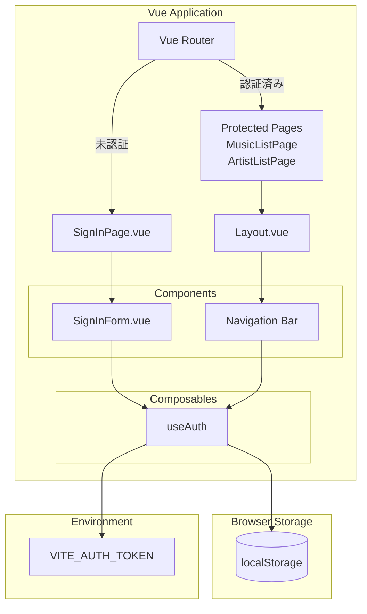
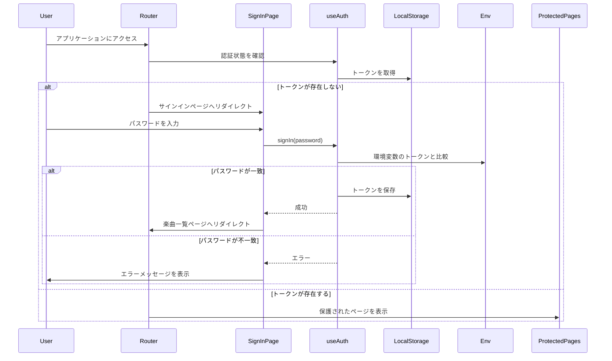
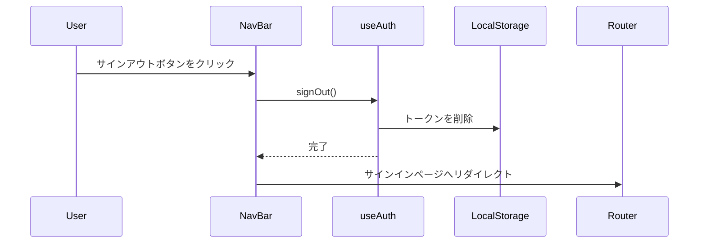

# 設計ドキュメント

## 概要

本設計は、プロセカ楽曲・アーティスト管理Webページに簡易的な認証機能を追加するものです。個人利用のマスタDB管理ページであり、不正アクセスの可能性は非常に低いため、固定トークン認証方式を採用し、コストをかけずにシンプルな認証システムを実装します。

### 設計目標

- 環境変数で管理される固定トークンによる認証
- localStorageを使用したセッション管理
- Vue Routerのナビゲーションガードによるルート保護
- Composableパターンによる認証ロジックの実装
- 既存のUIガイドラインに準拠したシンプルなUI

### 技術スタック

- Vue 3 (Composition API)
- TypeScript
- Vue Router
- Vite (環境変数管理)
- Tailwind CSS

## アーキテクチャ

### システム構成



### 認証フロー



### サインアウトフロー



## コンポーネントとインターフェース

### Composable: useAuth

認証ロジックを管理するComposable。

#### インターフェース

```typescript
interface UseAuthReturn {
  // 状態
  isAuthenticated: Ref<boolean>
  isLoading: Ref<boolean>
  error: Ref<string | null>
  
  // メソッド
  signIn: (password: string) => Promise<void>
  signOut: () => void
  checkAuth: () => boolean
}
```

#### 責務

- 環境変数から認証トークンを取得
- パスワードと認証トークンの比較
- localStorageへの認証トークンの保存・削除
- 認証状態の管理
- エラーハンドリング

#### 実装詳細

**環境変数の取得**
```typescript
const AUTH_TOKEN = import.meta.env.VITE_AUTH_TOKEN
```

**localStorageのキー**
```typescript
const AUTH_STORAGE_KEY = 'auth_token'
```

**signInメソッド**
- 入力されたパスワードと環境変数のトークンを比較
- 一致した場合、トークンをlocalStorageに保存
- 不一致の場合、エラーメッセージを設定

**signOutメソッド**
- localStorageからトークンを削除
- 認証状態をfalseに設定

**checkAuthメソッド**
- localStorageからトークンを取得
- 環境変数のトークンと一致するか確認
- 結果をbooleanで返す

### コンポーネント: SignInPage.vue

サインインページのコンテナコンポーネント。

#### 責務

- SignInFormコンポーネントの配置
- 認証成功時のリダイレクト処理
- エラー表示

#### Props

なし

#### Emits

なし

### コンポーネント: SignInForm.vue

サインインフォームのプレゼンテーショナルコンポーネント。

#### 責務

- パスワード入力フィールドの表示
- サインインボタンの表示
- フォームバリデーション
- ローディング状態の表示

#### Props

```typescript
interface Props {
  isLoading?: boolean
  error?: string | null
}
```

#### Emits

```typescript
interface Emits {
  submit: [password: string]
}
```

#### バリデーション

- パスワードが空の場合、サインインボタンを無効化

### コンポーネント: Layout.vue (既存の拡張)

既存のLayoutコンポーネントにサインアウトボタンを追加。

#### 追加要素

- ナビゲーションバーの右端にサインアウトボタンを配置
- 認証済みの場合のみ表示

### Router設定

#### ナビゲーションガード

```typescript
router.beforeEach((to, from, next) => {
  const { checkAuth } = useAuth()
  const isAuthenticated = checkAuth()
  
  // サインインページへのアクセス
  if (to.path === '/signin') {
    if (isAuthenticated) {
      // 認証済みの場合は楽曲一覧へリダイレクト
      next('/musics')
    } else {
      next()
    }
    return
  }
  
  // 保護されたルートへのアクセス
  if (!isAuthenticated) {
    // 未認証の場合はサインインページへリダイレクト
    next('/signin')
  } else {
    next()
  }
})
```

#### ルート定義

```typescript
const routes: RouteRecordRaw[] = [
  {
    path: '/signin',
    name: 'signin',
    component: SignInPage,
    meta: { requiresAuth: false }
  },
  {
    path: '/',
    redirect: '/musics',
  },
  {
    path: '/musics',
    name: 'musics',
    component: MusicListPage,
    meta: { requiresAuth: true }
  },
  {
    path: '/artists',
    name: 'artists',
    component: ArtistListPage,
    meta: { requiresAuth: true }
  },
]
```

## データモデル

### 環境変数

```typescript
// .env.local
VITE_AUTH_TOKEN=your-secret-token-here
```

### localStorage

```typescript
// キー: 'auth_token'
// 値: string (認証トークン)
{
  "auth_token": "your-secret-token-here"
}
```

### 認証状態

```typescript
interface AuthState {
  isAuthenticated: boolean
  isLoading: boolean
  error: string | null
}
```

## Correctness Properties

*プロパティとは、システムのすべての有効な実行において真であるべき特性や動作のことです。本質的には、システムが何をすべきかについての形式的な記述です。プロパティは、人間が読める仕様と機械で検証可能な正確性の保証との橋渡しとなります。*

### Property 1: 未認証時のサインインページリダイレクト

*任意の*保護されたルート（/musics, /artists）に対して、未認証状態でアクセスした場合、システムはサインインページ（/signin）にリダイレクトする。

**Validates: Requirements 1.1, 3.4, 5.2**

### Property 2: 認証トークン比較の正確性

*任意の*パスワード入力に対して、signInメソッドは環境変数の認証トークンと正確に比較し、一致する場合のみ認証成功とする。

**Validates: Requirements 2.1**

### Property 3: 認証成功時のセッション永続化

*任意の*正しいパスワードでサインインした場合、認証システムは認証トークンをlocalStorageに保存し、その後checkAuthメソッドがtrueを返す。

**Validates: Requirements 2.2, 3.1**

### Property 4: 認証状態の復元

*任意の*localStorageに有効な認証トークンが存在する状態でアプリケーションを初期化した場合、認証システムはユーザーを認証済みとして扱い、保護されたルートへのアクセスを許可する。

**Validates: Requirements 3.2, 3.3**

### Property 5: サインアウト時のセッション削除

*任意の*認証済み状態からsignOutメソッドを呼び出した場合、認証システムはlocalStorageから認証トークンを削除し、その後checkAuthメソッドがfalseを返す。

**Validates: Requirements 4.2**

### Property 6: 認証済みユーザーの保護されたルートアクセス

*任意の*保護されたルート（/musics, /artists）に対して、認証済み状態でアクセスした場合、システムは要求されたページを表示し、リダイレクトしない。

**Validates: Requirements 5.3**

## エラーハンドリング

### 認証エラー

**エラーケース:**
- パスワードが認証トークンと一致しない
- 環境変数が設定されていない

**ハンドリング方法:**

1. **パスワード不一致**
   - エラーメッセージ: 「認証に失敗しました」（汎用的なメッセージ）
   - 具体的なエラー理由は表示しない（セキュリティ考慮）
   - エラー状態をuseAuthのerror refに設定
   - UIでエラーメッセージを表示

2. **環境変数未設定**
   - コンソールにエラーメッセージを出力
   - メッセージ: 「VITE_AUTH_TOKEN environment variable is not set」
   - サインイン試行時にエラーメッセージを表示

### ネットワークエラー

本機能はネットワーク通信を行わないため、ネットワークエラーは発生しない。

### バリデーションエラー

**エラーケース:**
- パスワードフィールドが空

**ハンドリング方法:**
- サインインボタンを無効化
- エラーメッセージは表示しない（UX考慮）

### ルーティングエラー

**エラーケース:**
- 未認証状態で保護されたルートにアクセス
- 認証済み状態でサインインページにアクセス

**ハンドリング方法:**
- ナビゲーションガードで適切なページにリダイレクト
- エラーメッセージは表示しない（自動リダイレクトのため）

## テスト戦略

### デュアルテストアプローチ

本機能では、単体テストとプロパティベーステストの両方を使用して包括的なカバレッジを実現します。

- **単体テスト**: 特定の例、エッジケース、エラー条件を検証
- **プロパティテスト**: すべての入力にわたる普遍的なプロパティを検証

### プロパティベーステスト

**テストライブラリ**: fast-check (TypeScript/JavaScript用のプロパティベーステストライブラリ)

**設定:**
- 各プロパティテストは最低100回の反復を実行
- 各テストはコメントで設計ドキュメントのプロパティを参照

**タグ形式:**
```typescript
// Feature: simple-authentication, Property 1: 未認証時のサインインページリダイレクト
```

**テスト対象:**

1. **Property 1: 未認証時のサインインページリダイレクト**
   - ランダムな保護されたルート（/musics, /artists）を生成
   - 未認証状態でアクセス
   - サインインページにリダイレクトされることを確認

2. **Property 2: 認証トークン比較の正確性**
   - ランダムなパスワード文字列を生成
   - 正しいトークンと一致する場合は成功、不一致の場合は失敗を確認

3. **Property 3: 認証成功時のセッション永続化**
   - 正しいパスワードでサインイン
   - localStorageに認証トークンが保存されることを確認
   - checkAuthメソッドがtrueを返すことを確認

4. **Property 4: 認証状態の復元**
   - ランダムな有効な認証トークンをlocalStorageに設定
   - アプリケーションを初期化
   - 認証済み状態になることを確認

5. **Property 5: サインアウト時のセッション削除**
   - 認証済み状態からサインアウト
   - localStorageから認証トークンが削除されることを確認
   - checkAuthメソッドがfalseを返すことを確認

6. **Property 6: 認証済みユーザーの保護されたルートアクセス**
   - ランダムな保護されたルート（/musics, /artists）を生成
   - 認証済み状態でアクセス
   - リダイレクトされずにページが表示されることを確認

### 単体テスト

**テストライブラリ**: Vitest + @vue/test-utils

**テスト対象:**

**useAuth Composable:**
- サインイン成功時の動作（例: 正しいパスワード）
- サインイン失敗時の動作（例: 誤ったパスワード）
- サインアウト時の動作
- 環境変数未設定時のエラーハンドリング
- 初期化時の認証状態チェック

**SignInForm Component:**
- パスワード入力フィールドの存在確認
- サインインボタンの存在確認
- パスワードフィールドが空の場合のボタン無効化
- パスワード入力フィールドのtype属性がpasswordであることの確認
- ラベルの存在確認
- ローディング状態の表示
- エラーメッセージの表示

**SignInPage Component:**
- SignInFormコンポーネントのレンダリング
- 認証成功時のリダイレクト処理
- エラー表示

**Router Navigation Guard:**
- 未認証時の保護されたルートへのアクセス（サインインページへリダイレクト）
- 認証済み時のサインインページへのアクセス（楽曲一覧ページへリダイレクト）
- 認証済み時の保護されたルートへのアクセス（ページ表示）

**Layout Component:**
- 認証済み時のサインアウトボタン表示
- 未認証時のサインアウトボタン非表示

### E2Eテスト

**テストライブラリ**: Playwright

**テストシナリオ:**

1. **サインインフロー**
   - サインインページにアクセス
   - 正しいパスワードを入力
   - サインインボタンをクリック
   - 楽曲一覧ページにリダイレクトされることを確認

2. **サインイン失敗フロー**
   - サインインページにアクセス
   - 誤ったパスワードを入力
   - サインインボタンをクリック
   - エラーメッセージが表示されることを確認

3. **サインアウトフロー**
   - 認証済み状態で楽曲一覧ページにアクセス
   - サインアウトボタンをクリック
   - サインインページにリダイレクトされることを確認

4. **セッション永続化**
   - サインイン
   - ページをリロード
   - 認証済み状態が維持されることを確認

5. **ルート保護**
   - 未認証状態で保護されたルートに直接アクセス
   - サインインページにリダイレクトされることを確認

### テストカバレッジ目標

- 単体テスト: 80%以上のコードカバレッジ
- プロパティテスト: すべてのCorrectness Propertiesをカバー
- E2Eテスト: 主要なユーザーフローをカバー

### テストデータ

**環境変数:**
```typescript
// テスト用の固定トークン
VITE_AUTH_TOKEN=test-secret-token-12345
```

**テスト用パスワード:**
- 正しいパスワード: `test-secret-token-12345`
- 誤ったパスワード: `wrong-password`, ``, `invalid-token`

### テスト実行

```bash
# 単体テスト + プロパティテスト
npm run test

# E2Eテスト
npm run test:e2e

# カバレッジレポート
npm run test:coverage
```
